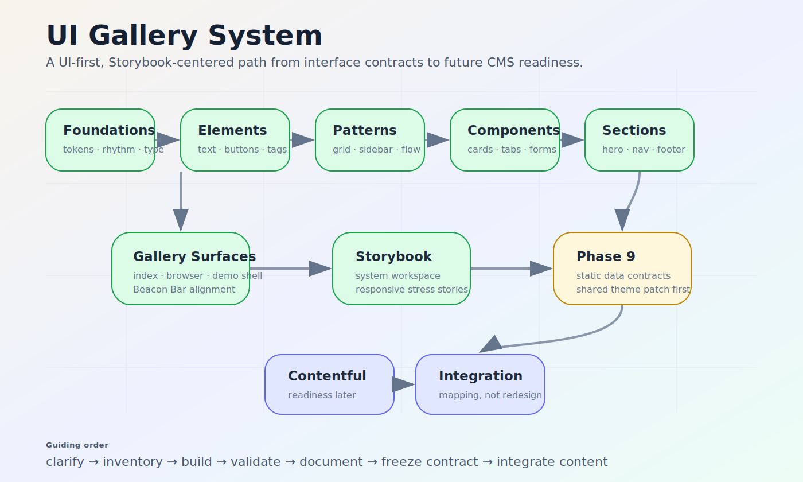
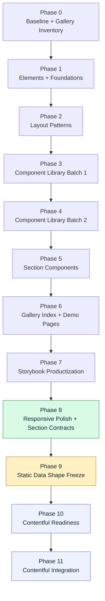
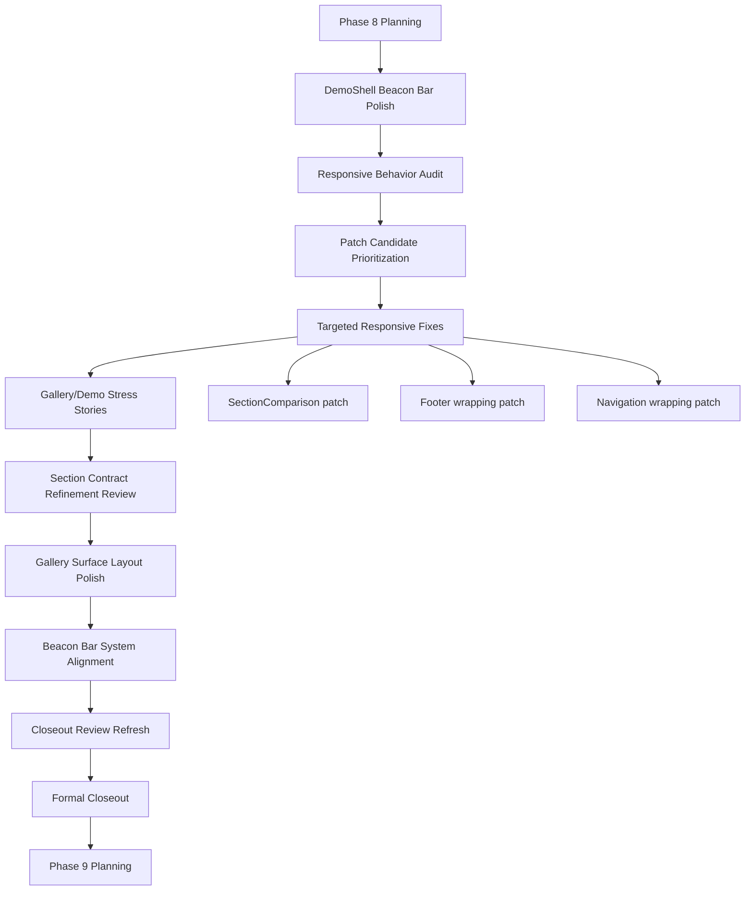
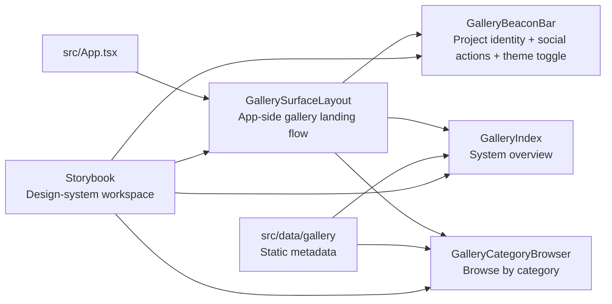
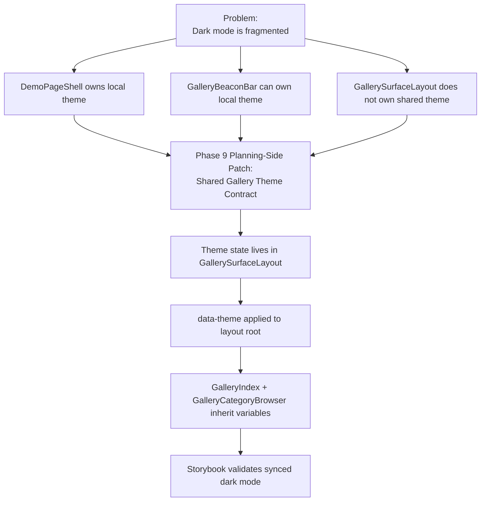

# Building a UI Gallery System: How a Design System Learns to Stand on Its Own

> **Current handoff state:** Phase 8 responsive polish and section contract refinement has been validated for closeout. If the repository has not already committed the closeout, the first move is formal Phase 8 closeout. After that, Phase 9 begins with planning and contract alignment — not full implementation. The next narrow bridge is the **Shared Gallery Theme Contract** patch.



## Who this is for

This documentation is written for a general audience: designers, content strategists, frontend developers, web producers, hiring teams, and future maintainers who want to understand what was built, why it was built this way, and how to continue without losing the thread.

Think of the project as a small city being planned in careful districts. First came the roads and utilities. Then came the homes. Then came the public squares, signs, maps, and lighting. Phase 8 was the moment the city was walked at every screen size, with rough edges polished and contracts checked before the next layer of data architecture begins.

---

## The project in one paragraph

This project is a **UI-first gallery system**: a frontend design-system project built in disciplined phases, validated through Storybook, and presented through an app-side gallery experience. It starts with foundations, primitives, layout patterns, reusable components, and sections before moving into gallery/demo surfaces. Contentful is intentionally deferred until the UI contracts are stable, so the CMS becomes a future mapping layer rather than the force that shapes the design system too early.

---

## The learning story: why this project matters

A common mistake in content-platform work is to start with the CMS model first. That feels productive, but it can trap the interface inside early content assumptions.

This project takes the opposite path:

1. **Clarify the UI system.**
2. **Build reusable pieces in dependency order.**
3. **Validate them in Storybook.**
4. **Create app-side gallery/demo surfaces.**
5. **Polish responsiveness and contracts.**
6. **Freeze static data shapes.**
7. **Only then prepare for Contentful.**

The result is not just a component library. It is a working argument for disciplined content operations: build the surface, prove the system, document the contract, then integrate the CMS.

---

## Current state snapshot

| Area | Current state |
|---|---|
| Project type | UI-first, Storybook-centered gallery system |
| Primary workflow | Phase-based, docs-first, contract-protected |
| Completed major layers | Foundations, elements, layout patterns, components, sections, gallery/demo surfaces, Storybook productization, responsive polish |
| Latest validated phase | Phase 8 — Responsive Polish + Section Contract Refinement |
| Current transition | Phase 8 formal closeout into Phase 9 planning |
| Next major phase | Phase 9 — Static Data Shape Freeze |
| Next immediate patch | Phase 9 Planning-Side Contract Patch — Shared Gallery Theme Contract |
| Contentful | Deferred until UI data contracts are stable |
| Storybook role | Primary design-system workspace |
| App gallery role | Browsable public/reference surface for the system |
| Main design lesson | Do not let CMS structure, tooling, or one-off UI polish outrun the system contract |

---

## Where we left off

The project reached a strong Phase 8 checkpoint.

Phase 8 completed or was validated to include:

- Phase 8 planning/contracts
- DemoShell Beacon Bar Polish
- responsive behavior audit
- responsive patch candidate prioritization
- SectionComparison mobile density and focus clipping patch
- Footer bottom-row wrapping patch
- Navigation long-label resilience patch
- gallery/demo responsive stress stories
- section contract refinement review
- Gallery Surface Layout Polish
- Beacon Bar System Alignment
- closeout review and closeout review refresh

The important decision: **no section or component API refinements were required.** The responsive problems were solved with local CSS patches and focused Storybook coverage. The gallery/demo layer stayed stable: no routes, no metadata shape changes, no Contentful assumptions.

The only open design-system lesson is dark-mode ownership. Dark mode is not broken because the colors are wrong. It is fragmented because multiple surfaces own theme state independently. The next narrow step is to move gallery/demo theme ownership into `GallerySurfaceLayout`, apply `data-theme` at the shared root, and let `GalleryIndex`, `GalleryCategoryBrowser`, and `GalleryBeaconBar` inherit the same contract.

---

# Visual overview

## Flowchart 1 — Full roadmap



## Flowchart 2 — Phase 8 closeout story



## Flowchart 3 — Current gallery/demo ownership



## Flowchart 4 — Next theme contract patch



---

# The system architecture in plain English

## 1. Foundations are the soil

The foundation layer includes tokens, base styles, typography, spacing, focus behavior, and global rhythm. These are not decorative extras. They are the soil every component grows from.

## 2. Elements are the atoms

Elements include text, buttons, inputs, images, tags, icons, and status labels. They should be boring in the best way: predictable, reusable, and stable.

## 3. Layout patterns are the streets

Rows, grids, sidebars, single-column flows, Z-patterns, F-patterns, magazine layouts, and asymmetrical compositions make the system flexible without forcing every component to reinvent layout.

## 4. Components are reusable rooms

Cards, tabs, accordions, stats, tables, forms, modals, testimonials, logos, pricing tables, and steps become recognizable reusable spaces.

## 5. Sections are page-level moments

Navigation, hero, footer, CTA, and feature rows are larger compositions. They should consume primitives and components rather than bypassing the system.

## 6. Gallery/demo surfaces are the map

The gallery lets someone browse what exists. Demo surfaces show how the system behaves in app-like conditions. Storybook is still the workshop; the gallery is the public map.

---

# What Phase 8 taught the project

Phase 8 was not about adding more features. It was about asking a harder question:

> Does the system still hold together when the screen gets smaller, the content gets longer, and the UI surfaces appear together?

The answer became yes, after targeted polish.

## Major Phase 8 lessons

### 1. Responsive polish should be evidence-based

The project did not patch randomly. It audited first, ranked risks, and then patched the areas that mattered most: SectionComparison density, Footer wrapping, Navigation long-label resilience, and gallery/demo responsive stress states.

### 2. API changes are not always the answer

A less mature project might respond to responsive issues by widening component APIs. This project resisted that. The review confirmed that local CSS and Storybook stress coverage were enough. That preserved the public contracts.

### 3. Gallery polish should not reopen gallery architecture

GallerySurfaceLayout and GalleryBeaconBar were aligned without reopening Phase 6. That matters because a good roadmap protects completed architecture unless a true regression appears.

### 4. Storybook is the workshop, not a screenshot collection

The useful stories are not just pretty states. They prove behavior: dense content, long labels, responsive wrapping, dark-mode sync, focus behavior, and section-level contract expectations.

---

# The next design-system lesson: shared theme ownership

The current dark-mode issue is an ownership issue.

Right now, theme state can live in local islands:

- `DemoPageShell` can own local theme state.
- `GalleryBeaconBar` can own local theme state.
- `GallerySurfaceLayout` does not yet own a shared gallery/demo theme contract.
- `GalleryIndex` and `GalleryCategoryBrowser` do not inherit one shared theme source.

The fix should be narrow:

```txt
Shared gallery/demo dark mode now.
Full design-system theme foundation later.
Contentful still later.
```

## Recommended implementation shape

| Concern | Recommended owner |
|---|---|
| Gallery/demo theme state | `GallerySurfaceLayout` |
| `data-theme` attribute | `GallerySurfaceLayout` root |
| Theme toggle UI | `GalleryBeaconBar` |
| Theme inheritance | `GalleryIndex` and `GalleryCategoryBrowser` |
| Local fallback | `DemoPageShell` keeps fallback behavior |
| Validation | Focused Storybook stories |

## Scoped variables to consider

```css
--gallery-bg
--gallery-surface
--gallery-surface-muted
--gallery-text
--gallery-text-muted
--gallery-border
--gallery-focus
```

Do not rewrite global tokens yet. Do not introduce a full `ThemeProvider`. Do not turn Phase 9 into a broad dark-mode redesign.

---

# How to recreate or pick up the project

## Step 1 — Start from the project philosophy

The project should be continued in this order:

```txt
clarify → inventory → build → validate → document → freeze contract → integrate content
```

Before adding anything new, ask:

- Does this belong to a primitive, pattern, component, section, or gallery/demo surface?
- Does this require a new API, or can it be solved locally?
- Does Storybook already prove the behavior?
- Does this introduce a CMS assumption too early?
- Does the task tracker and phase record agree?

## Step 2 — Confirm the planning state

Check these surfaces first:

```txt
README.md
TASKS.md
docs/IMPLEMENTATION-ROADMAP.md
docs/phases/PHASE-8-RESPONSIVE-POLISH-SECTION-CONTRACTS.md
docs/phases/PHASE-9-STATIC-DATA-SHAPE-FREEZE.md
docs/system/ARCHITECTURE.md
docs/system/GALLERY.md
docs/system/GALLERY-CONTRACTS.md
docs/system/RESPONSIVE-REVIEW.md
docs/system/SECTION-CONTRACT-REFINEMENT-REVIEW.md
```

They should agree on the same story:

- Phase 8 is closed or ready for formal closeout.
- Phase 9 is next or active.
- Phase 9 implementation has not begun unless explicitly documented.
- Static data shape freeze has not been completed yet.
- Contentful remains deferred.
- Storybook remains the primary design-system workspace.

## Step 3 — Verify before changing

Run the quality gates before and after any meaningful change:

```bash
nvm use
npm run build
npm run build-storybook
npm run lint
```

If a test script exists, run:

```bash
npm run test
```

If no test script exists, document:

```txt
npm run test: Not configured
```

## Step 4 — Continue with the smallest safe next patch

The next recommended patch is:

```txt
Phase 9 Planning-Side Contract Patch — Shared Gallery Theme Contract
```

The patch should:

- move gallery/demo theme ownership into `GallerySurfaceLayout`
- apply `data-theme` to the shared layout root
- pass controlled `theme` and `onThemeToggle` into `GalleryBeaconBar`
- let `GalleryIndex` and `GalleryCategoryBrowser` inherit shared theme variables
- preserve `DemoPageShell` local fallback behavior
- add focused Storybook coverage for synced dark mode
- avoid global token rewrites
- avoid Contentful
- avoid routes
- avoid broad primitive/component API changes

---

# Potential next steps

## Immediate next step

If Phase 8 closeout is not committed yet, close it first:

```bash
git add .
git commit -m "Close Phase 8 and activate Phase 9 planning"
```

Only commit after verification passes and after the docs agree.

## Next implementation candidate

```txt
Phase 9 Planning-Side Contract Patch — Shared Gallery Theme Contract
```

This is not full Phase 9 implementation. It is a narrow contract patch that protects the next phase from inheriting fragmented theme behavior.

## Phase 9 planning work

After the theme contract is aligned, Phase 9 should plan:

- static metadata inventory
- fixture ownership rules
- normalized UI data contracts
- section input shapes
- gallery/demo input shapes
- Contentful readiness criteria for later phases

## Later phases

```txt
Phase 10 — Contentful Readiness
Phase 11 — Contentful Integration
```

Contentful should enter only after the UI data contracts are frozen.

---

# Markdown styling system for future docs

Use a consistent markdown structure so every phase reads like part of the same handbook.

## Recommended document template

```md
# Phase X — Name

> One-line purpose statement.

## Status

Current status, last verified state, and next action.

## Why this phase matters

Plain-English explanation for a general audience.

## What changed

- Change 1
- Change 2
- Change 3

## What did not change

- No routes introduced
- No CMS assumptions added
- No API changes unless required

## Architecture note

The contract or ownership decision this phase clarified.

## Visual map

Mermaid diagram or ASCII sketch.

## Verification

Commands run and result.

## Next step

The smallest safe continuation.
```

## Recommended callout styles

```md
> **Learning note:** Explain the principle behind the implementation.
```

```md
> **Architecture guardrail:** State what must not change.
```

```md
> **Where we left off:** Name the current decision gate.
```

```md
> **Portfolio signal:** Explain what this proves to a hiring manager.
```

---

# Suggested imagery

## Hero image concept

**Alt text:** Abstract interface map showing a design system growing from tokens into components, sections, and gallery surfaces.

**Image prompt:**

```txt
A polished editorial-style isometric interface map showing a frontend design system evolving from design tokens into UI elements, layout patterns, reusable components, page sections, Storybook panels, and a gallery index. Modern web engineering aesthetic, soft grid, subtle glass surfaces, warm neutral background, precise labels, calm professional portfolio tone.
```

## Phase 8 image concept

**Alt text:** Responsive UI cards being checked across mobile, tablet, and desktop frames.

**Image prompt:**

```txt
A clean technical illustration of responsive web layouts across phone, tablet, and desktop screens, with subtle checkmarks on navigation, footer, comparison sections, and gallery cards. Design-system documentation style, soft shadows, accessible spacing, calm engineering mood.
```

## Phase 9 image concept

**Alt text:** One shared theme signal flowing from a layout shell into child gallery surfaces.

**Image prompt:**

```txt
A conceptual UI architecture diagram showing one central theme signal flowing from a gallery layout shell into a beacon bar, gallery index, and category browser. Light and dark mode shown as synchronized panels, restrained colors, senior frontend architecture documentation style.
```

---

# Final handoff summary

The project is standing at the threshold between visual-system maturity and data-contract maturity.

Phase 8 proved the system can hold together under responsive pressure. Phase 9 should now protect the next invisible layer: theme ownership, static fixtures, normalized view models, and eventual CMS mapping.

The next move should be small, deliberate, and contract-first:

```txt
Close Phase 8 if needed.
Patch shared gallery theme ownership.
Then plan static data shape freeze.
Keep Contentful deferred.
```

That is the shape of a system learning to stand on its own.
